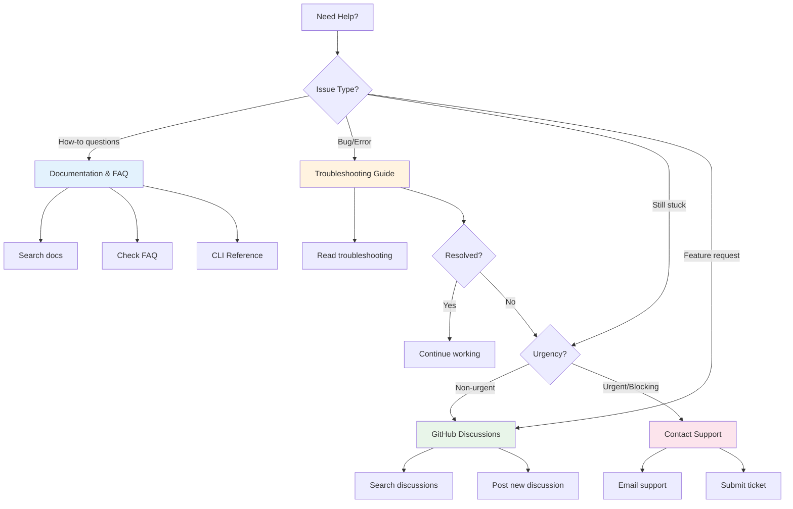

# Getting Help

Find the support you need, when you need it. We offer multiple ways to get help with Qualflare, from self-service resources to direct support.

## Choosing the Right Support Path

## Self-Help Resources

### Documentation Search
Search our comprehensive documentation to find answers to most questions:
- **Quick Start** - Get up and running in minutes
- **Concepts** - Understand Qualflare entities and how they relate
- **How-to Guides** - Step-by-step instructions for common tasks
- **Reference** - Detailed feature documentation
- **CLI Tool** - Command-line interface documentation

::: tip Tip
Use the search bar in the top-right corner of any documentation page to quickly find relevant content.
:::

### FAQ Section
Visit our [Frequently Asked Questions](/faq/) for answers to common questions about:
- Account and billing
- Test management
- Integrations
- CLI usage
- Troubleshooting

### Troubleshooting Guide
Check the [Troubleshooting Guide](/faq/troubleshooting) for solutions to common issues:
- Authentication problems
- Test upload failures
- CI/CD integration issues
- Performance problems

### CLI Reference
For CLI tool questions, see the [CLI documentation](/cli/):
- [Installation guide](/cli/installation)
- [Upload command](/cli/upload)
- [Other commands](/cli/other-commands)
- [CI/CD integration](/cli/ci-cd)

## Community Resources

### GitHub Discussions
Join the conversation on [GitHub Discussions](https://github.com/qualflare/qualflare/discussions):
- **Q&A**: Ask questions and get answers from the community
- **Ideas**: Share feature requests and discuss improvements
- **Show & Tell**: Show how you're using Qualflare

::: info Before Posting
Before creating a new discussion, search existing threads to see if your question has already been answered.
:::

### Community Forums
Connect with other Qualflare users:
- **Discord/Slack**: Join our community workspace (link coming soon)
- **Stack Overflow**: Browse questions tagged `qualflare` or ask your own

### Community Guidelines
When participating in community forums:
- Be respectful and constructive
- Search before posting
- Provide context and details
- Share solutions that worked for you

## Direct Support

### Support Email
For direct assistance, email us at:
- **Support**: support@qualflare.com
- **Enterprise**: enterprise@qualflare.com

### Submit a Ticket
For tracked support requests, submit a ticket through our [support portal](https://qualflare.com/support):
- Login with your Qualflare account
- Provide detailed information about your issue
- Track progress and updates

### Response Time Expectations
| Plan Type | Initial Response | Resolution Time |
|-----------|------------------|-----------------|
| Community | Community-driven | Variable |
| Standard | 24-48 hours | 3-5 business days |
| Enterprise | 4 hours | 24 hours |
| Critical* | 1 hour | 4 hours |

*Available for Enterprise plans with blocking production issues

### When to Contact Support
Contact support directly when:
- You've exhausted self-help resources
- The issue is blocking your workflow
- You need account or billing assistance
- You suspect a security vulnerability

## Reporting Bugs

### Bug Report Template
When reporting bugs via [GitHub Issues](https://github.com/qualflare/qualflare/issues), include:

**Required Information:**
- **Summary**: Brief description of the bug
- **Steps to Reproduce**:
  1. Step one
  2. Step two
  3. Step three
- **Expected Behavior**: What should happen
- **Actual Behavior**: What actually happens
- **Environment**:
  - Qualflare version (if applicable)
  - Browser and version (for web UI issues)
  - Operating system
  - CLI version (for CLI issues)

**Helpful Information:**
- Screenshots or screen recordings
- Error messages or stack traces
- Sample test files or configurations
- Console logs (for browser issues)

### Bug Report Best Practices
- **Search first**: Check if the bug has already been reported
- **One bug per issue**: Don't group unrelated issues
- **Be specific**: Detailed reports help us reproduce and fix faster
- **Use templates**: Fill out all required fields in the issue template

## Feature Requests

### Submitting Requests
We welcome feature requests! Submit them via:
- [GitHub Discussions](https://github.com/qualflare/qualflare/discussions) - For discussing ideas
- [GitHub Issues](https://github.com/qualflare/qualflare/issues) - Using the "feature request" template

### What to Include
- **Problem statement**: What problem does this solve?
- **Proposed solution**: How should it work?
- **Alternatives considered**: What other options did you think of?
- **Use case**: How would you use this feature?

### Voting on Requests
- Upvote existing feature requests you'd like to see implemented
- Comment with additional use cases or context
- Check if your request has already been submitted

## Documentation Feedback

### Reporting Docs Issues
Found an error in our documentation? Help us improve!
- **Typos/Grammar**: Use the "Edit on GitHub" link on any page
- **Missing Content**: Open a [documentation issue](https://github.com/qualflare/qualflare/issues/new?labels=documentation)
- **Confusing Explanations**: Let us know what needs clarification

### Suggesting Improvements
We want to make our documentation as helpful as possible:
- **What was missing**: What would have helped you?
- **What was confusing**: What didn't make sense?
- **Examples**: Suggest scenarios or examples to add

### Contributing
Want to contribute documentation? See our [contributing guide](https://github.com/qualflare/qualflare/blob/main/CONTRIBUTING.md) for guidelines.

## Still Need Help?

If you've tried the resources above and still need assistance:

1. **Search again** with different keywords
2. **Check the troubleshooting guide** for similar issues
3. **Ask the community** on GitHub Discussions
4. **Contact support** for direct assistance

We're here to help you succeed with Qualflare!

## Additional Resources

- **Status Page**: [status.qualflare.com](https://status.qualflare.com) - Check for ongoing incidents
- **Release Notes**: [GitHub Releases](https://github.com/qualflare/qualflare/releases) - See what's new
- **Blog**: [blog.qualflare.com](https://blog.qualflare.com) - Tips, tutorials, and updates
- **YouTube Channel**: [youtube.com/@qualflare](https://youtube.com/@qualflare) - Video tutorials (coming soon)
